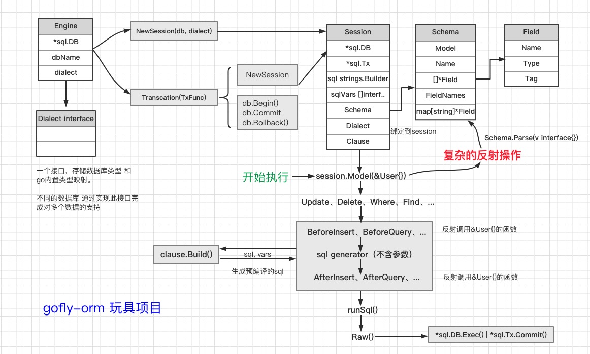

# gofly-orm ORM框架

**一套go语言的orm框架**

### TO DO
- [x] 对象表结构映射
- [x] 表的创建、删除、存在性判断
- [x] 记录新增查询
- [x] 链式操作与更新删除(Chain)
- [x] 实现钩子(Hooks)
- [x] 支持事务(Transaction)
- [ ] ....


### Structure


### Use：

```golang
package main

import (
	"fmt"
	gform "github.com/cddgo/gofly-orm"
	"github.com/cddgo/gofly-orm/session"
	"log"
)

type User struct {
	Name string `gform:"PRIMARY KEY"`
	Age  int
}

var (
	user1 = &User{"Tom", 18}
	user2 = &User{"Sam", 25}
	user3 = &User{"Jack", 25}
)

func main() {

	engine, _ := gform.NewEngine("sqlite3", "gofly.db")
	defer engine.Close()
	s := engine.NewSession().Model(&User{})

	testInsert(s)
	//test_Limit(s)
	//testUpdateFirstOrder(s)
	testDeleteAndCount(s)
}

func testInsert(s *session.Session) {
	err1 := s.DropTable()
	err2 := s.CreateTable()

	rows, err3 := s.Insert(user1, user2, user3)

	if err1 != nil || err2 != nil || err3 != nil {
		log.Fatal("failed init test records")
	}
	fmt.Println("插入成功:", rows)

	var users []User
	if err := s.Find(&users); err != nil {
		log.Fatal("failed to query all")
	}
	fmt.Println(users)
}

func test_Limit(s *session.Session) {
	var users []User
	err := s.Limit(2).Find(&users)
	if err != nil || len(users) != 2 {
		log.Fatal("failed to query with limit condition")
	}
	fmt.Println(users)
}

func testUpdateFirstOrder(s *session.Session) {
	affected, _ := s.Where("Name = ?", "Tom").Update("Age", 310)
	u := &User{}
	_ = s.OrderBy("Age DESC").First(u)

	if affected != 1 || u.Age != 310 {
		log.Fatal("failed to update")
	}
	fmt.Println(u)
}

func testDeleteAndCount(s *session.Session) {
	affected, _ := s.Where("Name = ?", "Tom").Delete()
	fmt.Println(affected)
	count, _ := s.Count()

	if affected != 1 || count != 2 {
		log.Fatal("failed to delete or count")
	}
	fmt.Println(count)
}
```

<hr>
仅学习使用